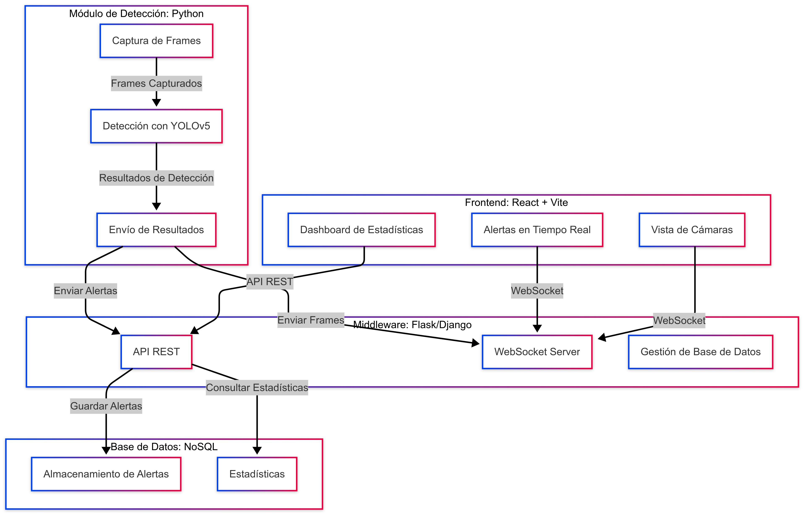

# weapon-detection-middlaware
# 📝 Optimización de un sistema de reconocimiento de armas y desarrollo de un middleware para la gestión de APIs

## Authors

- [@aaolmedo2](https://www.github.com/aaolmedo2)
- [@janarvaez11](https://www.github.com/janarvaez11)

# Content:
- 🏗️Architecture Thesis 
- 🗺️Diagram Thesis
- ⚙️Work Flow 
- 📅Calendar
- 💡Thesis Ideas 
- 📷Detection mudule

## Architecture Thesis 
**DETECTION MODULE → BRAIN (Python)**

- Technologies

Yolo 8 → detección de armas.

Open CV → capturar y procesar los frames.

WebSocket o HTTP → para enviar los resultados en el middleware. 

- Feature

Procesar los frames de las cámaras, realizar detecciones y enviar los resultados al middleware.


**MIDDLEARE → BACKEND (DJANGO - FLASK)**
- Technologies
  
Flask o DJANGO → manejar las APIs REST y WebSockets.

MongoDB → almacenar alertas, usuarios para un dashboard, etc. 

- Feature

Gestionar las peticiones del frontend, coordinar la comunicación con el módulo de detección y manejar la base de datos.

- EndPoints

GET /cameras: Obtener la lista de cámaras disponibles.

POST /alerts: Registrar una alerta en la base de datos.

GET /alerts: Obtener las alertas almacenadas.

WebSocket /stream: Enviar frames y alertas en tiempo real al frontend.

**DATA BASE NoSQL → MongoDB**

- Feature
  
Almacenar las alertas y estadísticas.

Technologies

MongoDB.

Estructura de Datos
```bash
{
"alert_id": "unique_id",
"camera_id": "CAM1",
"timestamp": "2025-04-22T10:00:00Z",
"confidence": 0.95,
"image_url": "path/to/snapshot.jpg"
}
```


**UI/UX → FRONT END (REACT + VITE)**

- Feature

Mostrar las cámaras en tiempo real, alertas y un dashboard con estadísticas.

- Technologies

React para la interfaz de usuario.

Vite para un desarrollo rápido y eficiente.

WebSocket para recibir datos en tiempo real desde el backend (alertas y frames de las cámaras).

- Componentes Clave

Vista de camaras.

Alertas.

Dashboard ADMIN.

## Diagram Thesis


## Work Flow
- Captura de Frames
- El módulo de detección (main.py) captura los frames de las cámaras y realiza la detección de armas.
- Si se detecta un arma, se envía una alerta al middleware con los datos relevantes (cámara, confianza, snapshot).
- Procesamiento del middalware
- El middleware recibe los datos del módulo de detección.
- Guarda la alerta en la base de datos.
- Envía la alerta al frontend a través de WebSocket.
- Visualizacion en el frontend
- El frontend recibe los datos en tiempo real y actualiza la interfaz (notificaciones, streams, dashboard).

Claro, Inge. El **paso 6** se refiere a cómo **actualizar el submódulo** en tu proyecto principal cuando se han hecho cambios en el repositorio del submódulo (por ejemplo, si tú o alguien más subió una nueva versión del `WeaponDetector` al repo `weapon-detection-service`).

---

## ✅ Paso a paso para actualizar el submódulo

Estás en el **repositorio principal** (el middleware), que tiene el submódulo en `weapon-detection-service/`.

### 🔁 1. Entrar al submódulo y actualizar

```bash
cd weapon-detection-service
git checkout main      # o la rama que estés usando
git pull origin main   # trae los últimos cambios del submódulo
```

Esto actualizará el contenido del submódulo localmente.

---

### 🔄 2. Volver al repositorio principal y registrar el cambio

El submódulo es como un **puntero a un commit específico** del otro repo. Entonces ahora que lo actualizaste, debes **decirle al repo principal que quieres usar ese nuevo commit del submódulo**:

```bash
cd ..
git add weapon-detection-service
git commit -m "Update submodule to latest commit"
```

---

### ☁️ 3. Subir los cambios al repositorio principal

```bash
git push origin main
```

Ahora el repositorio principal sabrá que debe usar la nueva versión del submódulo.

---

## 🧠 ¿Y si alguien clona mi proyecto después?

Para que el submódulo también se descargue correctamente:

```bash
git clone --recurse-submodules <URL-del-repo-principal>
```

O, si ya clonaron sin submódulos:

```bash
git submodule update --init --recursive
```

---

¿Quieres que te dé un script de bash que automatice esos pasos por ti (`pull`, `add`, `commit`, `push`)?
